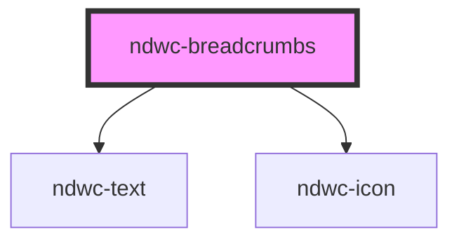

# ndwc-breadcrumbs

<!-- Auto Generated Below -->

## Properties

| Property      | Attribute | Description | Type           | Default     |
| ------------- | --------- | ----------- | -------------- | ----------- |
| `breadcrumbs` | --        |             | `Breadcrumb[]` | `undefined` |
| `dark`        | `dark`    |             | `boolean`      | `false`     |

## Events

| Event               | Description | Type                      |
| ------------------- | ----------- | ------------------------- |
| `breadcrumbClicked` |             | `CustomEvent<MouseEvent>` |

## Dependencies

### Depends on

- [ndwc-text](../text)
- [ndwc-icon](../icon)

### Graph

----------------------------------------------

*Built with [StencilJS](https://stenciljs.com/)*
