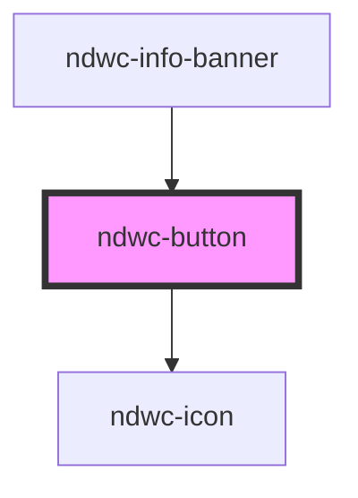

# ndwc-button

<!-- Auto Generated Below -->

## Properties

| Property   | Attribute  | Description | Type                                     | Default     |
| ---------- | ---------- | ----------- | ---------------------------------------- | ----------- |
| `compact`  | `compact`  |             | `boolean`                                | `false`     |
| `dark`     | `dark`     |             | `boolean`                                | `false`     |
| `disabled` | `disabled` |             | `boolean`                                | `false`     |
| `icon`     | `icon`     |             | `string`                                 | `undefined` |
| `type`     | `type`     |             | `string`                                 | `'button'`  |
| `variant`  | `variant`  |             | `"primary" \| "secondary" \| "tertiary"` | `'primary'` |

## Dependencies

### Used by

 - [ndwc-info-banner](../info-banner)

### Depends on

- [ndwc-icon](../icon)

### Graph

----------------------------------------------

*Built with [StencilJS](https://stenciljs.com/)*
