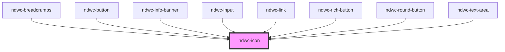

# ndwc-icon

<!-- Auto Generated Below -->

## Properties

| Property            | Attribute | Description | Type                   | Default     |
| ------------------- | --------- | ----------- | ---------------------- | ----------- |
| `color`             | `color`   |             | `string`               | `undefined` |
| `icon` _(required)_ | `icon`    |             | `string`               | `undefined` |
| `size`              | `size`    |             | `"lg" \| "md" \| "sm"` | `'md'`      |

## Dependencies

### Used by

 - [ndwc-breadcrumbs](../breadcrumbs)
 - [ndwc-button](../button)
 - [ndwc-info-banner](../info-banner)
 - [ndwc-input](../input)
 - [ndwc-link](../link)
 - [ndwc-rich-button](../rich-button)
 - [ndwc-round-button](../round-button)
 - [ndwc-text-area](../text-area)

### Graph

----------------------------------------------

*Built with [StencilJS](https://stenciljs.com/)*
