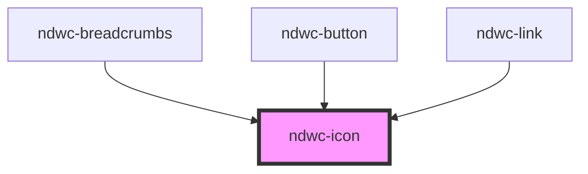

# ndwc-icon

<!-- Auto Generated Below -->

## Properties

| Property | Attribute | Description | Type                   | Default |
| -------- | --------- | ----------- | ---------------------- | ------- |
| `color`  | `color`   |             | `string`               | `''`    |
| `icon`   | `icon`    |             | `string`               | `''`    |
| `size`   | `size`    |             | `"lg" \| "md" \| "sm"` | `'md'`  |

## Dependencies

### Used by

 - [ndwc-breadcrumbs](../breadcrumbs)
 - [ndwc-button](../button)
 - [ndwc-link](../link)

### Graph

----------------------------------------------

*Built with [StencilJS](https://stenciljs.com/)*
