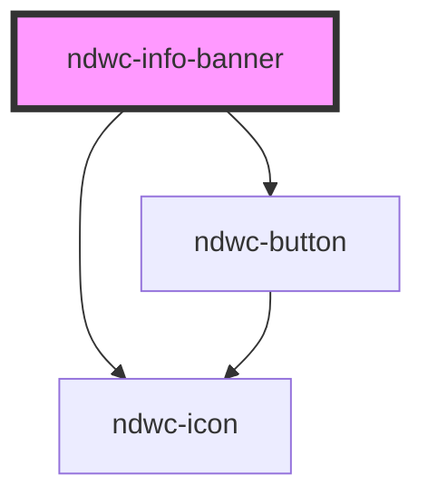

# ndwc-info-banner

<!-- Auto Generated Below -->

## Properties

| Property | Attribute | Description | Type      | Default     |
| -------- | --------- | ----------- | --------- | ----------- |
| `action` | `action`  |             | `string`  | `undefined` |
| `label`  | `label`   |             | `string`  | `undefined` |
| `soft`   | `soft`    |             | `boolean` | `undefined` |

## Events

| Event           | Description | Type                      |
| --------------- | ----------- | ------------------------- |
| `actionClicked` |             | `CustomEvent<MouseEvent>` |

## Dependencies

### Depends on

- [ndwc-icon](../icon)
- [ndwc-button](../button)

### Graph

----------------------------------------------

*Built with [StencilJS](https://stenciljs.com/)*
