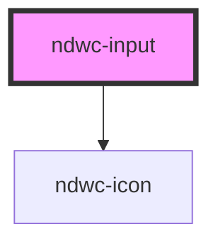

# ndwc-input

<!-- Auto Generated Below -->

## Properties

| Property    | Attribute   | Description | Type      | Default     |
| ----------- | ----------- | ----------- | --------- | ----------- |
| `disabled`  | `disabled`  |             | `boolean` | `undefined` |
| `error`     | `error`     |             | `string`  | `undefined` |
| `hint`      | `hint`      |             | `string`  | `undefined` |
| `icon`      | `icon`      |             | `string`  | `undefined` |
| `inputmode` | `inputmode` |             | `string`  | `'text'`    |
| `label`     | `label`     |             | `string`  | `undefined` |
| `readonly`  | `readonly`  |             | `boolean` | `undefined` |
| `type`      | `type`      |             | `string`  | `'text'`    |
| `value`     | `value`     |             | `string`  | `undefined` |

## Events

| Event   | Description | Type                      |
| ------- | ----------- | ------------------------- |
| `blur`  |             | `CustomEvent<FocusEvent>` |
| `focus` |             | `CustomEvent<FocusEvent>` |

## Dependencies

### Depends on

- [ndwc-icon](../icon)

### Graph

----------------------------------------------

*Built with [StencilJS](https://stenciljs.com/)*
