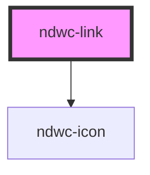

# ndwc-link

<!-- Auto Generated Below -->

## Properties

| Property   | Attribute  | Description | Type                   | Default     |
| ---------- | ---------- | ----------- | ---------------------- | ----------- |
| `external` | `external` |             | `boolean`              | `undefined` |
| `href`     | `href`     |             | `string`               | `undefined` |
| `icon`     | `icon`     |             | `string`               | `undefined` |
| `size`     | `size`     |             | `"lg" \| "md" \| "sm"` | `'md'`      |

## Dependencies

### Depends on

- [ndwc-icon](../icon)

### Graph

----------------------------------------------

*Built with [StencilJS](https://stenciljs.com/)*
