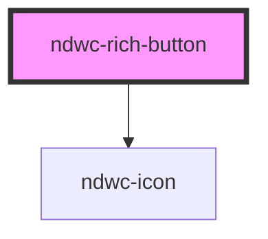

# ndwc-rich-button

<!-- Auto Generated Below -->

## Properties

| Property     | Attribute     | Description | Type      | Default     |
| ------------ | ------------- | ----------- | --------- | ----------- |
| `disabled`   | `disabled`    |             | `boolean` | `false`     |
| `icon`       | `icon`        |             | `string`  | `undefined` |
| `label`      | `label`       |             | `string`  | `undefined` |
| `labelFirst` | `label-first` |             | `boolean` | `undefined` |

## Dependencies

### Depends on

- [ndwc-icon](../icon)

### Graph

----------------------------------------------

*Built with [StencilJS](https://stenciljs.com/)*
