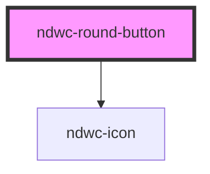

# ndwc-round-button

<!-- Auto Generated Below -->

## Properties

| Property            | Attribute  | Description | Type      | Default     |
| ------------------- | ---------- | ----------- | --------- | ----------- |
| `disabled`          | `disabled` |             | `boolean` | `false`     |
| `icon` _(required)_ | `icon`     |             | `string`  | `undefined` |

## Dependencies

### Depends on

- [ndwc-icon](../icon)

### Graph

----------------------------------------------

*Built with [StencilJS](https://stenciljs.com/)*
