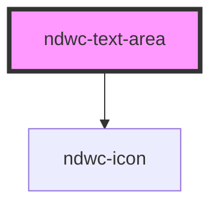

# ndwc-text-area

<!-- Auto Generated Below -->

## Properties

| Property    | Attribute   | Description | Type      | Default     |
| ----------- | ----------- | ----------- | --------- | ----------- |
| `disabled`  | `disabled`  |             | `boolean` | `undefined` |
| `error`     | `error`     |             | `string`  | `undefined` |
| `hint`      | `hint`      |             | `string`  | `undefined` |
| `label`     | `label`     |             | `string`  | `undefined` |
| `maxlength` | `maxlength` |             | `number`  | `undefined` |
| `note`      | `note`      |             | `string`  | `undefined` |
| `readonly`  | `readonly`  |             | `boolean` | `undefined` |
| `rows`      | `rows`      |             | `number`  | `undefined` |
| `value`     | `value`     |             | `string`  | `''`        |

## Dependencies

### Depends on

- [ndwc-icon](../icon)

### Graph

----------------------------------------------

*Built with [StencilJS](https://stenciljs.com/)*
