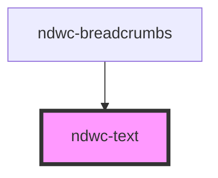

# ndwc-text

<!-- Auto Generated Below -->

## Properties

| Property | Attribute | Description | Type                                                                     | Default     |
| -------- | --------- | ----------- | ------------------------------------------------------------------------ | ----------- |
| `as`     | `as`      |             | `"div" \| "li" \| "p" \| "span"`                                         | `'p'`       |
| `header` | `header`  |             | `boolean`                                                                | `undefined` |
| `size`   | `size`    |             | `"lg" \| "md" \| "sm" \| "xl" \| "xxl" \| "xxxl" \| "xxxxl" \| "xxxxxl"` | `'md'`      |
| `weight` | `weight`  |             | `"bold" \| "medium" \| "regular"`                                        | `'regular'` |

## Dependencies

### Used by

 - [ndwc-breadcrumbs](../breadcrumbs)

### Graph

----------------------------------------------

*Built with [StencilJS](https://stenciljs.com/)*
